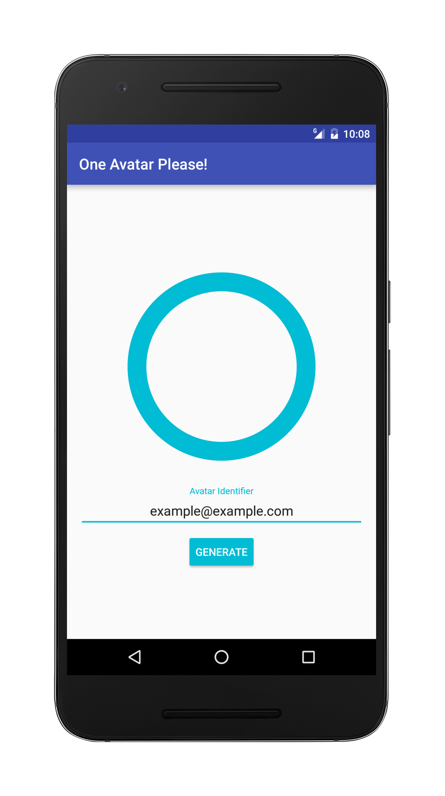
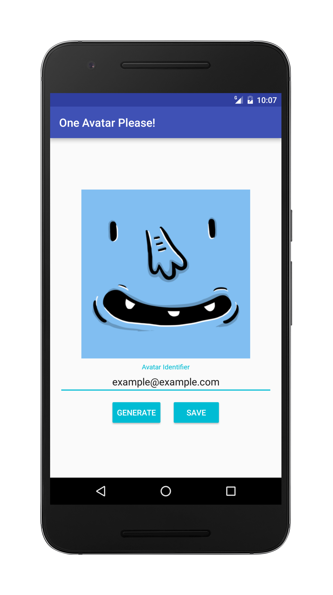
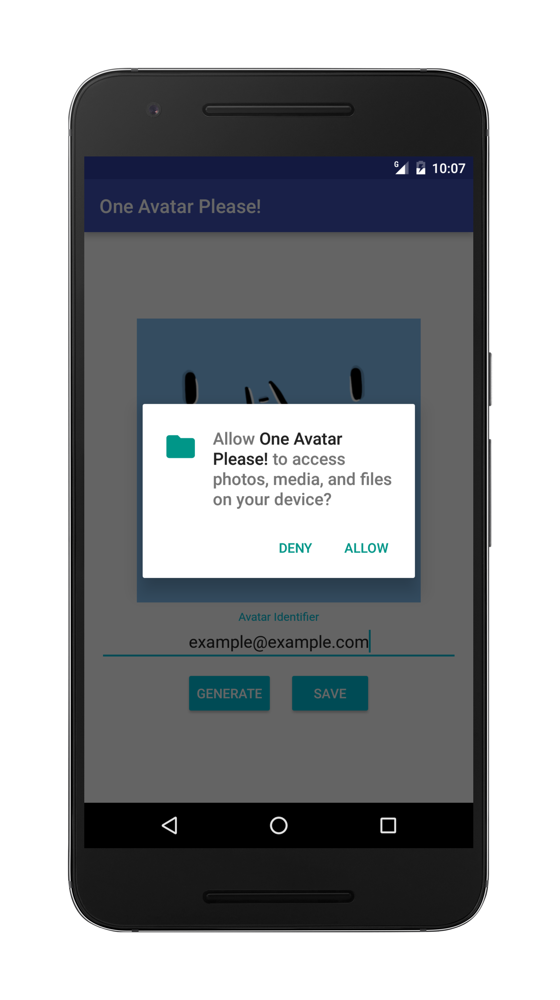
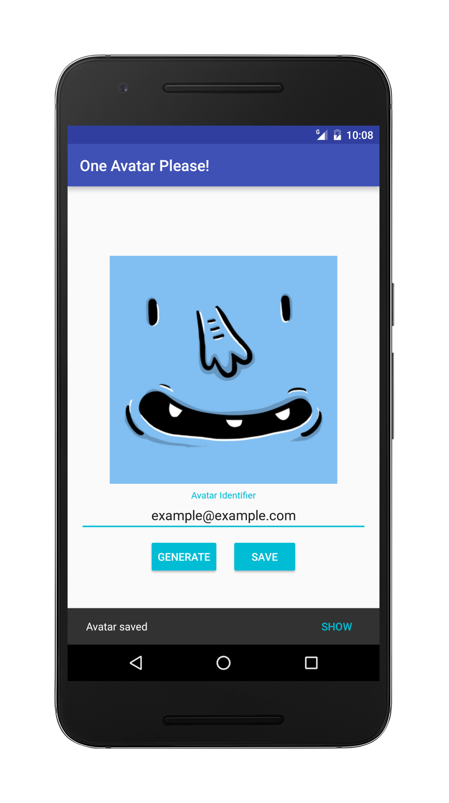
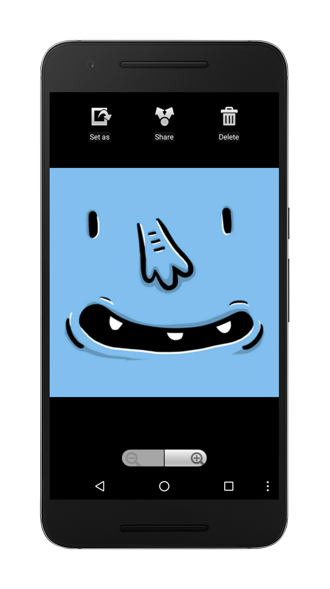

# One Avatar Please! 
"One Avatar Please!" is an Avatar Generator Android app built using the MVP Architecture.

## Features
* Generate avatars with an Identifier that can be a name, nickname, email, a random text, etc.
* Save the generated avatars to the user phone where they can easily access and use it wherever they want.

## Libraries Used

* [ButterKnife]
* [Dagger]
* [Retrolambda]
* [Picasso]
* [Material Circular Progress View]
* [Mockito]
* [Robolectric]

[ButterKnife]:https://jakewharton.github.io/butterknife/
[Dagger]:https://google.github.io/dagger/
[Retrolambda]:https://github.com/orfjackal/retrolambda
[Picasso]:https://square.github.io/picasso/
[Material Circular Progress View]:https://github.com/rahatarmanahmed/CircularProgressView
[Mockito]:http://mockito.org/
[Robolectric]:http://robolectric.org/

## API Used

[Adorable Avatars]

[Adorable Avatars]:http://avatars.adorable.io/

## Screenshots

## Thanks

* [ordago] for the extensive help with detecting App bugs and amazing suggestions for improvements to UI and UX.

[ordago]:https://github.com/ordago
