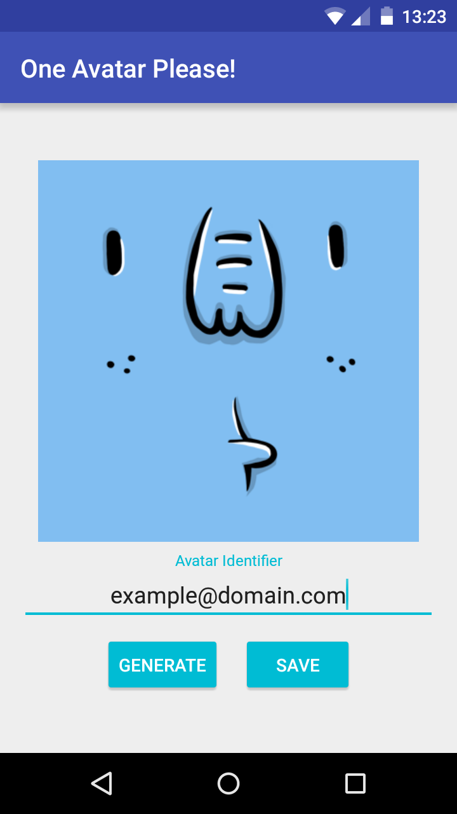

# One Avatar Please!
"One Avatar Please!" is an Avatar Generator Android app built using the MVP Architecture.

## Features
* Generate avatars with an Identifier that can be a name, nickname, email, a random text, etc.
* Save the generated avatars to the user phone where they can easily access it and use it wherever they want.

## Libraries Used

* [ButterKnife]
* [Dagger]
* [Picasso]

[ButterKnife]:https://github.com/JakeWharton/butterknife
[Dagger]:https://github.com/google/dagger
[Picasso]:https://github.com/square/picasso

## API Used

[Adorable Avatars]

[Adorable Avatars]:http://avatars.adorable.io/

## Screenshot

